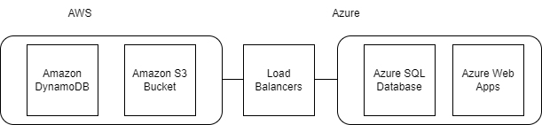

# A Multi-Cloud Application

## Getting Started

This folder contains the scaffolding Terraform code to deploy your project. Once you select the appropriate cloud providers, you will need to research specific Terraform modules for your select service and add those modules to the provided Terraform scaffolding. 

### Resources
See the documentation here:
- For [Azure](https://registry.terraform.io/providers/hashicorp/azurerm/latest/docs)
- For [AWS](https://registry.terraform.io/providers/hashicorp/aws/latest/docs)

### Dependencies

```
- Terraform
- Azure access
- AWS access
```

### Installation

**NOTE:** This project assumes you have already set up your labs from the course and created your personal git copies of the repositories:

1. Open the AWS portal from the classroom
    1. Open AWS CloudShell
    2. Run the following commands to install Terraform:
        1. `sudo yum install -y yum-utils`
        2. `sudo yum-config-manager --add-repo https://rpm.releases.hashicorp.com/AmazonLinux/hashicorp.repo`
        3. `sudo yum -y install terraform`
    2. Clone your git repo
2. Open the Azure portal from the classroom
    1. Open the Azure Cloud Shell
        1. Select PowerShell when prompted. Then click Show advanced settings on the next screen
        2. You can leave the resource group selected, but you’ll need to put in a name for the storage account and file share for your console. Name your storage account all lowercase with no dashes or punctuation. And less than 24 characters. Something like tscottocloudcstorage and tscottofileshare. Then click Create. Allow the console to provision. 
    2. Clone your git repo


## Project Instructions

### Requirements
Your goal is to select a cloud provider for each of the 4 required services - SQL server, S3 storage, web app and NoSQL database. Also don't forget to consider cost and flexibility of pricing options.

1. Select a cloud provider for SQL server
    1. Must utilize at least 2 vCPU
    2. 150GB of storage
    3. We will be migrating an existing SQL server instance
    4. We would like to bring our own SQL licensing
2. Select a cloud provider for S3 storage
    1.  Must have full S3 API capability
    2.  Global replication
3. Select a cloud provider for the NoSQL database
    1. Global availability
    2. Highly scalable pricing
4. Select a cloud provider for the Web app
    1. Existing dotnet application (note this is NOT a static website)

### Infrastructure
With the requirements in mind, your team decided to use AWS S3 due to full S3 API compatibility. The team decided on Azure SQL and a dotnet web app due to Microsoft being the creators of both those technologies. You have the highest compatibility and support from Microsoft with both SQL and dotnet. The team chose AWS DynamoDB over Azure's counterpart due to DynamoDB's global availability and highly scalable pricing. DynamoDB provides seamless, multi-region replication, ensuring global availability for the NoSQL database. Its flexible and on-demand pricing model allows for efficient scaling based on actual usage, providing cost-effectiveness. Additionally, AWS DynamoDB offers robust features like automatic and instant scalability, consistent performance, and built-in security, making it a preferred choice for the team's requirements. Azure Cosmos DB, Azure's counterpart, may have similar features but the specific combination of global availability and highly scalable pricing led the team to opt for AWS DynamoDB.


